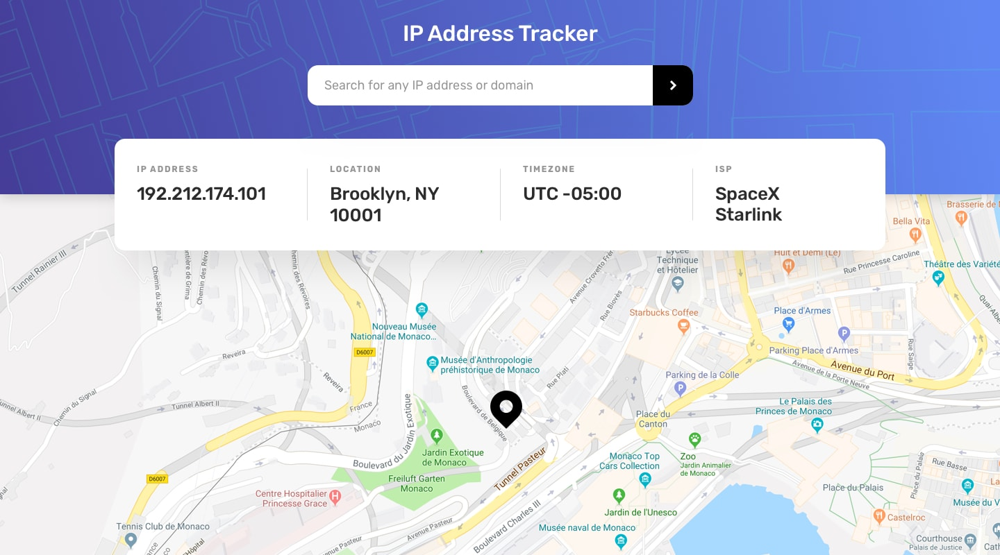

# Frontend Mentor - IP Address Tracker

A responsive and premium IP Address Tracker application built with React, TypeScript, Vite, Tailwind CSS v4, and Leaflet Maps. This application allows users to search for any IP address or domain name and displays key geolocation details (IP, Location, Timezone, ISP) along with an interactive map pointing to the location.

## Preview



## Features

- **IP & Domain Tracking**: Search for any valid IPv4/IPv6 address or domain name.
- **Client IP Autodetect**: Automatically geolocates and displays details for the user's IP address on initial load.
- **Interactive Maps**: Uses React Leaflet with a custom black marker pin showing the precise location.
- **Premium Responsive Design**: Styled using a customized Tailwind CSS v4 layout that adapts to both desktop and mobile devices. On mobile, the Info Card switches to a compact 2x2 grid to preserve vertical space for the map view.
- **Robust API Service**: Integrates with the IPify Geolocation API using Axios for client-side queries.

## Tech Stack

- **Framework**: React 19 (using arrow function components)
- **Language**: TypeScript (with strict verbatimModuleSyntax constraints)
- **Bundler**: Vite
- **Styling**: Tailwind CSS v4 (fully customized with asset background patterns)
- **Map Library**: Leaflet & React Leaflet
- **HTTP Client**: Axios

## Getting Started

Follow these steps to run the project locally.

### Prerequisites

Ensure you have [Node.js](https://nodejs.org/) installed (v18 or higher recommended).

### Installation

1. Clone the repository:
   ```bash
   git clone https://github.com/Sammie-sudo/ip-address-tracker.git
   cd ip-address-tracker
   ```

2. Install dependencies:
   ```bash
   npm install
   ```

3. Start the development server:
   ```bash
   npm run dev
   ```
   Open [http://localhost:5173/](http://localhost:5173/) in your browser to view the application.

4. Build for production:
   ```bash
   npm run build
   ```

## Configuration

The app uses the IPify Geolocation API. The key is managed inside the service layer `src/services/ipApi.ts` for standard requests. If you want to use your own key, configure it there.
